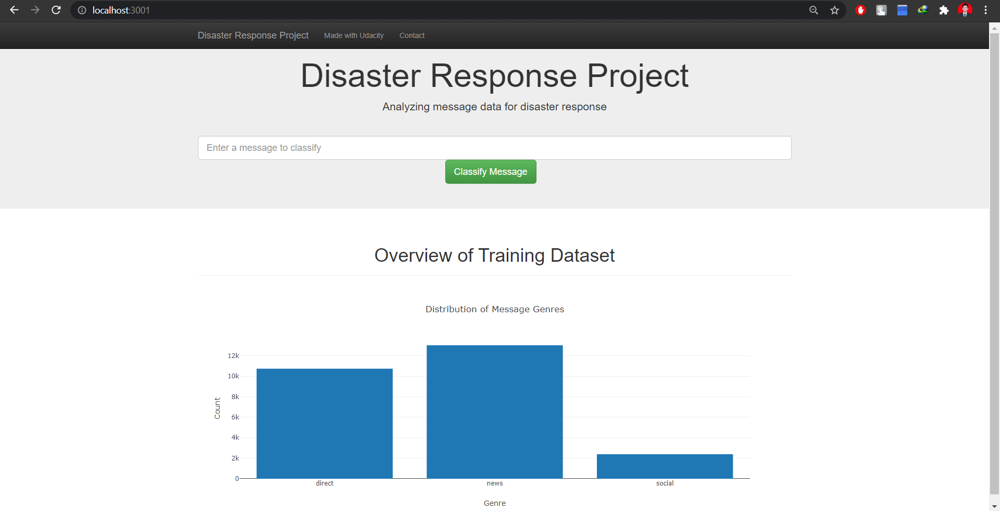
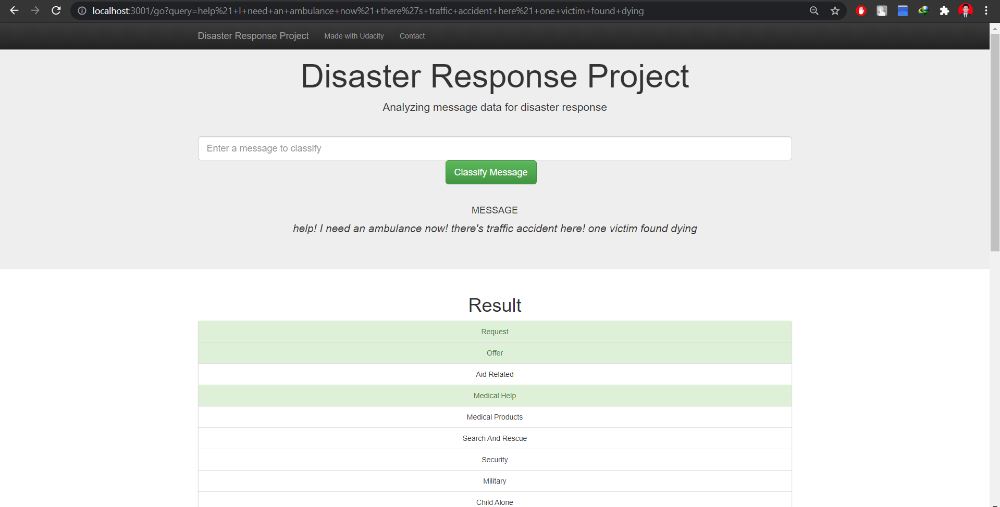

# Disaster Response Pipeline Project

## Project Description
In this project, you'll find a web app where you can input a new message and get classification results in several categories. The web app will also display visualizations of the data. The classifier model is based on Random Forest classifier which is trained on a data set containing real messages that were sent during disaster events.

Below are a few screenshots of the web app.

## Requirements

In order to run the project in your localhost, you are highly recommended to create a new virtual environment using either [`conda env`](https://conda.io/docs/user-guide/tasks/manage-environments.html) or [`python venv`](https://docs.python.org/3/tutorial/venv.html). Afterwards, install all dependencies packages using `pip -r install requirements.txt`.

## Instructions:
1. Run the following commands in the project's root directory to set up the database and model.

    - To run ETL pipeline that cleans data and stores in database 
        `python data/process_data.py data/disaster_messages.csv data/disaster_categories.csv data/DisasterResponse.db`
    - To run ML pipeline that trains classifier and saves 
        `python models/train_classifier.py data/DisasterResponse.db models/classifier.pkl`

2. Run the following commands to run the web app. 
	`cd app` 
    `python run.py` 

3. Go to http://0.0.0.0:3001/ in your localhost

## Description of Files & Directories

**The structure of the project directories and files**

Project_2 
├── app 
│   ├── templates 
│   │   ├── go.html 
│	│	└── master.html 
│	└── run.py 
├── data 
│   ├── disaster_categories.csv 
│   ├── disaster_messages.csv 
│	├── DisasterResponse.db 
│	└── process_data.py 
├── images 
│	├── home.png 
│	└── query.png 
├── models 
│	├── classifier.pkl 
│	└── train_classifier.py 
├── README.md 
└── requirements.txt 

- The [`app`](./app) directory contains files and directories for Flask back-end and Bootstrap and Plotly front-end.
- The [`data`](./data) directory contains datasets in CSV files and SQLite database and a Python module for processing them.
- The [`images`](./images) directory consists of PNG files for display purpose.
- The [`models`](./models) directory consists of the trained model (in .pkl extension) and the script for building the model.
- The [`README.md`](./README.md) file is this readme.
- The [`requirements.txt`](./requirements.txt) is list of dependencies needed to run this project.

## Acknowledgment
Acknowledgment should go to [Figure Eight](https://www.figure-eight.com/) for providing the dataset. This repo is one of the Projects of [Data Scientist Nanodegree on Udacity](https://www.udacity.com/course/data-scientist-nanodegree--nd025).

## License
[MIT License](../LICENSE)